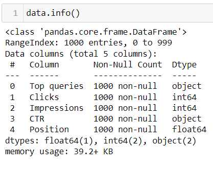
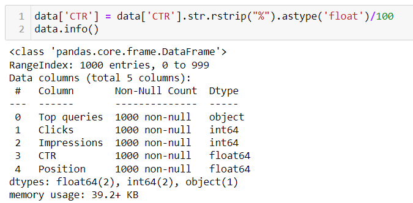
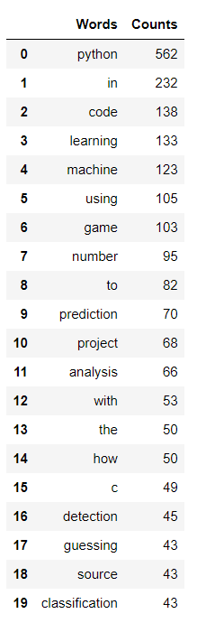
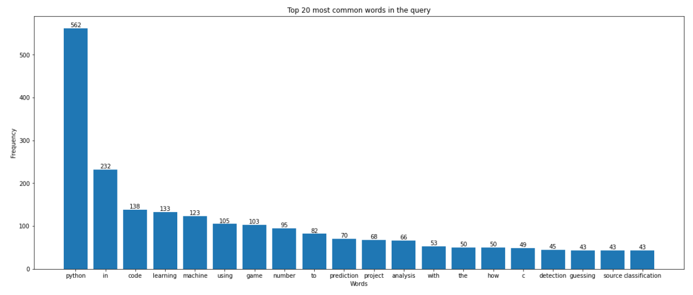
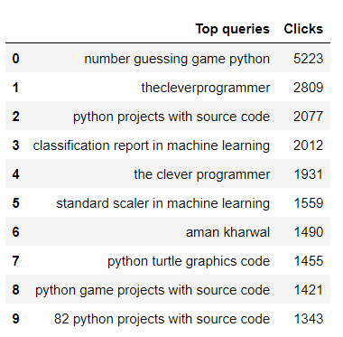
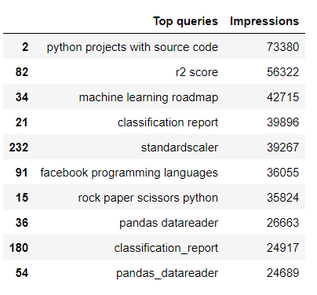

# Google Search Queries Anomaly Detection using Python
 This project implements anomaly detection techniques to identify unusual patterns in search query data. By analyzing search queries, the system can detect outliers that may indicate irregular user behavior, system issues, or potential security threats. The project utilizes Python libraries for data preprocessing, feature engineering, and applying machine learning models to classify and visualize anomalies in search query logs.

## 1. Reading the data:
The dataset in total has 5 columns:  
<b>1. Top Queries:</b> These are the queries that were actually used by the web surfers.  
<b>2. Clicks: </b> These are the number of times that the user clicked on the websites of the search result.  
<b>3. Impressions:</b> These are the number of times the websites appeared on the search engine in response to the query.  
<b>4. CTR (Click Through Rate):</b> This is the ratio of click to the impression, indicating the effectiveness of the query in leading users to the website.  
<b>5. Position:</b> This is the average ranking of the website in search results for the query. 

After the data is read, there seems to be no any NULL or missing values but if we look at the data type of the columns below, CTR is shown as object, so in the future to do any kinds of operations on it, we need to convert its data type to float:  
 
<b> Original Data-type:</b> 
 

 
 
<b> Changing the data type of CTR:</b>  
 

 

## 2. Top 20 words in the query:
Below are the top 20 words based on the frequency count that appeared often in the query:  

  A bar chart that represents the most frequent word in the query: <b>  
 

## 3. Top 10 Queries based on the Impressions and on the number of Clicks:
#### Number of clicks:

#### Number of Impressions:

